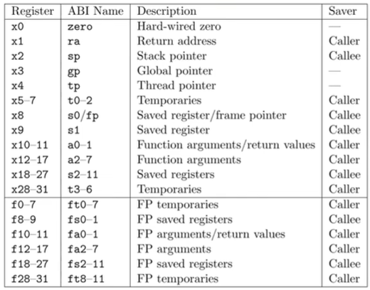

# Config

## Download ubuntu 20.04
https://cn.ubuntu.com/download/alternative-downloads

## config for os 6.081
```
sudo apt update
sudo apt install gcc
sudo apt install make cmake
sudp apt install vim

sudo apt install git build-essential gdb-multiarch gcc-riscv64-linux-gnu binutils-riscv64-linux-gnu
sudo apt install qemu-system-misc=1:4.2-3ubuntu6

riscv64-unknown-elf-gcc --version // 检查
sudo apt install gcc-riscv64-unknown-elf // 显示缺失
qemu-system-riscv64 --version // 检查

mkdir Projects
git clone git://g.csail.mit.edu/xv6-labs-2020 // 获取代码
cd xv6-labs-2020

git checkout util //切换到xv6-labs-2020代码库的lab1分支
make qemu

ls // 成功显示文件即表示配置完成
ctrl+p, 打印进程信息
ctrl+a, 再按x即可退出

sudo apt install openssh-server // 安装ssh
sudo service ssh start // 启动ssh
sudo ufw disable // 关闭防火墙
sudo service ssh status // 查看状态
sudo apt install net-tools
ifconfig // 查看ip

windows -> cmd: ping ip // 检查是否能ping通

windows -> vscode -> install remote-ssh
remote-ssh: config
  Host ubuntu-os
    HostName 192.168.236.134
    User ubuntu-os
    ForwardAgent yes
连接即可

```



## test

vim hello.cpp
```c++
#include <iostream>

int main() {
  std::cout << "hello, world." << std::endl;
  return 0;
}
```
g++ -o hello hello.cpp
./hello

## gdb

```shell
https://static.dev.sifive.com/dev-tools/riscv64-unknown-elf-gcc-8.3.0-2020.04.1-x86_64-linux-ubuntu14.tar.gz
mv riscv64-unknown-elf-gcc-8.3.0-2020.04.1-x86_64-linux-ubuntu14/bin/riscv64-unknown-elf-gdb ~/
chmod 777 ~/riscv64-unknown-elf-gdb
echo add-auto-load-safe-path /home/hxj/Projects/xv6-labs-2020/.gdbinit > ~/.gdbinit


```

```shell
# https://github.com/riscv-collab/riscv-gnu-toolchain
release: riscv64-elf-ubuntu-20.04-gcc-nightly-2024.04.12-nightly.tar.gz

tar -xzvf riscv64-elf-ubuntu-20.04-gcc-nightly-2024.04.12-nightly.tar.gz
vim ~/.bashrc
# 添加: export PATH=$PATH:/home/hxj/riscv/bin
source ~/.bashrc

vim .gdbinit
add-auto-load-safe-path /home/hxj/xv6-labs-2020/.gdbinit # enable execution of this file
set auto-load safe-path / # completely disable this security protection

~/Projects/xv6-labs-2020$ make CPUS=1 qemu-gdb
~/Projects/xv6-labs-2020$ riscv64-unknown-elf-gdb
```

```shell
(gdb) info breakpoints
(gdb) info registers
(gdb) info frame
(gdb) backtrace
(gdb) frame {frame_id}
(gdb) info frame
(gdb) info args
(gdb) info locals
(gdb) b {func_name}
(gdb) b {func_name} if condition
(gdb) delete # del all points
(gdb) watch {val_name}
(gdb) n
(gdb) si
(gdb) c
(gdb) layout asm
(gdb) layout reg
(gdb) layout split
(gdb) layout src
```


## write app

```makefile
UPROGS=\
  # ...
	$U/_copy\
	$U/_hello\
	$U/_open\
```

```c
#include "kernel/types.h"
#include "user/user.h"

int main() {
    char buf[64];

    while (1) {
        int sz = read(0, buf, sizeof(buf));
        if (sz <= 0) {
            break;
        }

        write(1, buf, sz);
    }

    exit(0);
}
```

```c
#include "kernel/types.h"
#include "user/user.h"

int main() {
    char msg[] = "hello, world.";
    printf("%s, %d\n", msg, strlen(msg));

    exit(0);
}
```

```c
#include "kernel/types.h"
#include "user/user.h"

#include "kernel/fcntl.h"

int main() {
    int fd = open("output.txt", O_WRONLY | O_CREATE);
    write(fd, "hello, world.\n", 14);

    exit(0);
}
```