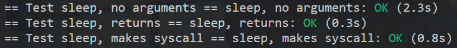
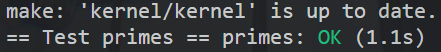
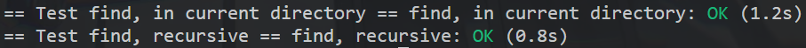

# Lab 1

## config
```
cd Projects/
cd xv6-labs-2020/
git checkout util
make qemu
```

## test copy.c
```
ubuntu-os@ubuntu:~/Projects/xv6-labs-2020$ sudo apt-install vim
ubuntu-os@ubuntu:~/Projects/xv6-labs-2020$ cd user
ubuntu-os@ubuntu:~/Projects/xv6-labs-2020$ vim copy.c
```

```c
#include "kernel/types.h"
#include "user/user.h"

int main() {
    char buf[64];

    while (1) {
        int n = read(0, buf, sizeof(buf)); // sizeof(buf)能够获取数组大小
        
        if (n <= 0) break;
        
        write(1, buf, n);
    }
    
    exit(0);
}
```

```
ubuntu-os@ubuntu:~/Projects/xv6-labs-2020$ vim Makefile
UPROGS=\
        $U/_cat\
        $U/_echo\
        $U/_forktest\
        $U/_grep\
        $U/_init\
        $U/_kill\
        $U/_ln\
        $U/_ls\
        $U/_mkdir\
        $U/_rm\
        $U/_sh\
        $U/_stressfs\
        $U/_usertests\
        $U/_grind\
        $U/_wc\
        $U/_zombie\
        $U/_copy\ // 添加到此处
```

```
ubuntu-os@ubuntu:~/Projects/xv6-labs-2020$ make qemu
$ copy // 调用
abc
abc
```

## 1.sleep
```c
// xv6-labs-2020/user/sleep.c
#include "kernel/types.h"
#include "user/user.h"

int main(int argc, char* argv[]) {
    printf("(nothing happens for a little while)\n");

    int sleep_time = atoi(argv[1]);
    sleep(sleep_time);

    exit(0);
}
```

### 更新Makefile
ubuntu-os@ubuntu:~/Projects/xv6-labs-2020$ vim Makefile
```makefile
# xv6-labs-2020/Makefile
UPROGS=\
    # ...
    $U/_sleep\ // 添加到此处
```

### 验证

```python
# - #!/usr/bin/env python
# + #!/usr/bin python
```

```shell
$ sudo python3 ./grade-lab-util sleep
```



## 2.pingpong

```c
#include "kernel/types.h"
#include "user/user.h"

int main() {
    int ports[2];

    pipe(ports);
    if (fork() == 0) {
        int pid = getpid();

        char msg[2];
        read(ports[0], msg, 1);
        close(ports[0]); // read over, close read port
        printf("%d: received ping\n", pid);
        
        write(ports[1], msg, 1);
        close(ports[1]); // write over, close write port 
    } else {
        int pid = getpid();

        char msg[2] = "p";
        write(ports[1], msg, 1);
        close(ports[1]); // write over, close write port 

        wait((int*) 0);

        read(ports[0], msg, 1);
        close(ports[0]); // read over, close read port
        printf("%d: received pong\n", pid);
    }

    exit(0);
}
```

```c
// pingpong.c
#include "kernel/types.h"
#include "kernel/stat.h"
#include "user/user.h"

int main(int argc, char * argv[]) {
    // 创建管道会得到长度为2的int数组
    // [0]为从管道读取数据的文件描述符, [1]为向管道写入数据的文件描述符
    int parent2child[2];
    int child2parent[2];
    pipe(parent2child);
    pipe(child2parent);

    //char message[] = "pingpong"; // size == 9

    int pid = fork(); // 一次调用两次返回, 父进程中返回子进程的pid, 子进程中返回0
    if (pid != 0) { // parent
        write(parent2child[1], "ping", 5);
        char buf[5];
        read(child2parent[0], buf, 5);
        printf("%d: received %s\n", getpid(), buf);
    } else { // child
        char buf[5];
        read(parent2child[0], buf, 5);
        printf("%d: received %s\n", getpid(), buf);
        write(child2parent[1], "pong", 5);
    }
    
    close(parent2child[0]);
    close(parent2child[1]);
    close(child2parent[0]);
    close(child2parent[0]);

    exit(0);
}

```


## 3.primes

```c
#include "kernel/types.h"
#include "user/user.h"

void func(int left[]) {
    int beg = 0;
    if (read(left[0], &beg, sizeof(int)) == 0) {
        exit(0);
    }
    printf("prime %d\n", beg);

    int right[2]; // 向右的管道
    pipe(right);
    
    if (fork() == 0) {
        close(right[1]);
        func(right);
        close(right[0]);

        exit(0);
    } else {
        close(right[0]);
        int num;
        while (read(left[0], &num, sizeof(int))) { // 从左管道读取
            if (num % beg != 0) {
                write(right[1], &num, sizeof(int));
            }
        }
        close(right[1]);
        
        wait((int*) 0);
        exit(0);
    }
}

int main() {
    int right[2]; // 向右的管道
    pipe(right);
    
    if (fork() == 0) { // child
        close(right[1]);
        func(right);
        close(right[0]);

        exit(0);
    } else { // parent
        close(right[0]);
        for (int num = 2; num <= 35; ++num) {
            if (num == 2) {
                printf("prime %d\n", num);
            } else if (num % 2 != 0) {
                write(right[1], &num, sizeof(int));
            }
        }
        close(right[1]);

        wait((int*) 0);
        exit(0);
    }
}
```




## 4.find

```c
#include "kernel/types.h"
#include "kernel/stat.h"
#include "kernel/fs.h"

#include "user/user.h"

// Write a simple version of the UNIX find program: 
// find all the files in a directory tree with a specific name. 

/*
Some hints:
    Look at user/ls.c to see how to read directories.
    Use recursion to allow find to descend into sub-directories.
    Don't recurse into "." and "..".
    Changes to the file system persist across runs of qemu; to get a clean file system run make clean and then make qemu.
    You'll need to use C strings. Have a look at K&R (the C book), for example Section 5.5.
    Note that == does not compare strings like in Python. Use strcmp() instead.
    Add the program to UPROGS in Makefile.
*/
int find(char *path, char* filename);

int main(int argc, char* argv[]) {
    if(argc != 3){
        fprintf(2, "input: find {path} {filename}");
        exit(1);
    }

    int res = find(argv[1], argv[2]);

    exit(res);
}

int find(char* path, char* filename) {
    // check
    int fd;
    if((fd = open(path, 0)) < 0){
        fprintf(2, "find: cannot open %s\n", path); // 2 is debug console
        return 1;
    }

    struct stat st;
    if(fstat(fd, &st) < 0){
        fprintf(2, "ls: cannot stat %s\n", path); // 2 is debug console
        close(fd);
        return 1;
    }

    if (st.type == T_FILE) {
        fprintf(2, "path isn't a dir!\n");
        return 1;
    }

    char buf[512];
    char* p;
    if(strlen(path) + 1 + DIRSIZ + 1 > sizeof buf){
        fprintf(2, "ls: path too long\n");
        return 1;
    }
    strcpy(buf, path);
    p = buf + strlen(buf);
    *p++ = '/'; // 在buf后面追加'\'，再往前移一个下标

    struct dirent de;
    while(read(fd, &de, sizeof(de)) == sizeof(de)){
        if(de.inum == 0)
            continue;
        
        memmove(p, de.name, DIRSIZ);
        p[DIRSIZ] = 0;
        if(stat(buf, &st) < 0){ // read file's intro
            printf("ls: cannot stat %s\n", buf);
            continue;
        }

        // buf: path/name
        if (st.type == T_DIR && strcmp(de.name, ".") != 0 && strcmp(de.name, "..") != 0) {
            char path_n[512];
            strcpy(path_n, buf);
            find(path_n, filename);
        } else if (st.type == T_FILE && strcmp(de.name, filename) == 0) {
            printf("%s\n", buf);
        }
    }

    close(fd);

    return 0;
}
```



## 5.xargs

