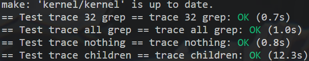

# Lab 2

```shell
$ git fetch
$ git checkout syscall
$ make clean
```

## first shell

```
kernel/kernel.asm, kernel.ld 
kernel/entry.S:7 _entry()
kernel/start.c:11 start()
-> kernel/main.c main() 
-> kernel/proc.c userinit() 
-> user/initcode.S 
-> kernel/syscall.c syscall() 
-> kernel/sysfile.c sys_exec() 
-> kernel/exec.c exec() 
-> user/init.c main()
```


## 1.trace

(1) 打通syscall调用逻辑

```makefile
# Makefile
UPROGS=\
	#...
	$U/_trace\
```

```c
// user/user.h
int trace(int);
```

```c
// user/usys.pl
entry("trace");
```

```c
// kernel/syscall.h
#define SYS_trace  22
```

```c
// kernel/syscall.c
static uint64 (*syscalls[])(void) = {
    //...
    [SYS_trace]   sys_trace,
};
```

```c
// kernel/sysproc.c
uint64 sys_trace(void) { // lab2 trace
    printf("hello, this is trace\n");
    return 0;
}
```

(2) 实现函数调用

proc结构体增加字段

```c
// kernel/proc.h
struct proc {
    //...
    // lab2 trace
    int mask; // 使用32位bit记录不同的系统调用是否被trace
};
```

在fork函数中新增mask的复制

```c
// kernel/proc.c
int fork(void) {
    //...
    np->mask = p->mask; // lab2 trace
    //...
}
```

实现sys_trace函数

```c
// kernel/sysproc.c
uint64 sys_trace(void) { // lab2 trace
    int mask;
    argint(0, &mask); // 读取参数
    myproc()->mask = mask; // 设置mask

    return 0;
}
```

在syscall的分发中打印sysycall调用信息

```c
// kernel/syscall.c
// syscall num begin with 1, "unknow" is used to occupy index
static char* syscall_name[] = {
    "unknow", "fork", "exit", "wait", "pipe", "read", "kill", 
    "exec", "fstat", "chdir", "dup", "getpid", "sbrk", 
    "sleep", "uptime", "open", "write", "mknod", "unlink", 
    "link", "mkdir", "close", "trace", 
};

void syscall(void) {
    int num; // record syscall num
    struct proc *p = myproc(); // get cur running proc

    num = p->trapframe->a7;
    if(num > 0 && num < NELEM(syscalls) && syscalls[num]) {
        uint64 exit_code = syscalls[num]();
        
        p->trapframe->a0 = exit_code;
        // lab2 trace
        if (p->mask & (1 << num)) {
          	printf("%d: syscall %s -> %d\n", p->pid, syscall_name[num], exit_code);
        }
    } else {
        printf("%d %s: unknown sys call %d\n",
                p->pid, p->name, num);
        p->trapframe->a0 = -1;
    }
}
```

(3) 验证

```python
# grade-lab-syscall

# - #!/usr/bin/env python
# + #!/usr/bin python
```

```shell
sudo python3 ./grade-lab-syscall trace
```




## 2.sysinfo

添加一个系统调用sysinfo，它收集有关正在运行的系统的信息。

这个系统调用有一个参数：一个指向结构体sysinfo的指针（参见kernel/sysinfo.h）。

内核应该填充这个结构体的字段：

​	freemem字段：空闲内存的字节数，

​	nproc：进程状态不是UNUSED的进程数。

(1) 调用逻辑

```makefile
# Makefile
UPROGS=\
	# ...
	$U/_sysinfotest\
```

```c
// user/user.h
struct sysinfo;
int sysinfo(struct sysinfo*); // lab2 sysinfo
```

```c
// user/usys.pl
entry("sysinfo"); # lab2 sysinfo
```

```c
// kernel/syscall.h
#define SYS_sysinfo  23 // lab2 sysinfo
```

```c
// kernel/syscall.c
extern uint64 sys_sysinfo(void); // lab2 sysinfo
static uint64 (*syscalls[])(void) = {
    //...
    [SYS_sysinfo] sys_sysinfo, // lab2 sysinfo
};
```

(2) 实现具体逻辑

实现nproc，遍历proc数组，记录state字段不等于UNUSED的进程

```c
// kernel/proc.c
uint64 get_proc_cnt() { // lab2 sysinfo
    uint64 cnt = 0;
    for (int i = 0; i < NPROC; i++) {
        if (proc[i].state != UNUSED) {
            cnt += 1;
        }
    }
    return cnt;
}
```

实现freemem，定义全局变量freemem，在初始化、分配、回收函数中更新freemem

```c
// kernel/kalloc.c

// lab2 sysinfo
uint64 freemem = 0; // 全局变量

void kinit() {
  //...
  freemem = (uint64)PHYSTOP - (uint64)end; // lab2 sysinfo
}

void
kfree(void *pa)
{
  struct run *r;

  if(((uint64)pa % PGSIZE) != 0 || (char*)pa < end || (uint64)pa >= PHYSTOP)
    panic("kfree");

  // Fill with junk to catch dangling refs.
  memset(pa, 1, PGSIZE);

  r = (struct run*)pa;

  acquire(&kmem.lock);
  r->next = kmem.freelist;
  kmem.freelist = r;
  release(&kmem.lock);

  freemem += (uint64)PGSIZE; // lab2 sysinfo
}

// Allocate one 4096-byte page of physical memory.
// Returns a pointer that the kernel can use.
// Returns 0 if the memory cannot be allocated.
void* kalloc(void) {
    //...
    if (r) { // lab2 sysinfo
    	freemem -= (uint64)PGSIZE;
    }
    //...
}

uint64 get_freemem(void) { // lab2 sysinfo
  	return freemem;
}
```

将增加的函数添加到defs.h头文件中

```c
// kernel/defs.h

// kalloc.c
//...
uint64          get_freemem(void); // lab2 sysinfo

// proc.c
//...
uint64             get_proc_cnt(); // lab2 sysinfo
```

实现接口函数

```c
// kernel/sysproc.c
uint64 sys_sysinfo(void) { // lab2 sysinfo
    uint64 freemem = get_freemem();
    uint64 cnt = get_proc_cnt();
    struct sysinfo info = {freemem, cnt};

    uint64 user_addr;
    // 读取user_addr参数
    if (argaddr(0, &user_addr) < 0) {
      return -1;
    }
    // 写入user_addr
    if (copyout(myproc()->pagetable, user_addr, (char *)&info, sizeof(info)) < 0) {
      return -1;
    }

    return 0;
}
```

(3) 验证

```python
# grade-lab-syscall

# - #!/usr/bin/env python
# + #!/usr/bin python
```

```shell
sudo python3 ./grade-lab-syscall sysinfo
```


