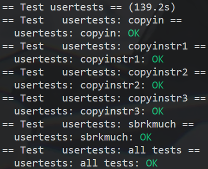

# Lab 3

```shell
  $ git fetch
  $ git checkout pgtbl
  $ make clean
```


## 1.Print a page table

打印页表信息

```c
// kernel/defs.h

// vm.c
//...
void            vmprint(pagetable_t pagetable);
```

```c
// kernel/vm.c

// print pagetable
void vmprint(pagetable_t pagetable, uint64 level) {
    // typedef uint64 pte_t;
    // typedef uint64 *pagetable_t; // 512 PTEs
    if (level == 2) {
        printf("page table %p\n", pagetable);
    }
    
    // there are 2^9 = 512 PTEs in a page table.
    for(int i = 0; i < 512; i++){
        pte_t pte = pagetable[i];
        if((pte & PTE_V) && (pte & (PTE_R|PTE_W|PTE_X)) == 0){ // ...0001
            // level-2 or level-1
            if (level == 2) {
                printf("..");
            } else {
                printf(".. ..");
            }
            uint64 child = PTE2PA(pte);
            printf("%d: pte %p pa %p\n", i, pte, child);
            vmprint((pagetable_t)child, level-1);
        } else if(pte & PTE_V){
            // level-0
            printf(".. .. ..%d: pte %p pa %p\n", i, pte, PTE2PA(pte));
        }
    }
}
```

```c
// kernel/exec.c

int exec(char *path, char **argv) {
    // ...
    if (p->pid == 1) {
    	vmprint(p->pagetable);
  	}
}
```

```shell
# grade-lab-syscall

# - #!/usr/bin/env python
# + #!/usr/bin python
```

```shell
sudo python3 ./grade-lab-pgtbl pte printout
```


## 2. A kernel page table per process

因为内核页表不包含用户地址的映射，所以用户地址在内核中是无效的。

因此，当内核需要使用在系统调用中传递的用户指针（例如，传递给write（）的缓冲区指针）时，内核必须首先将指针（用户空间的地址）转换为物理地址。本节和下一节的目标是允许内核直接解引用用户指针。

修改内核，以便每个进程在内核中执行时使用自己的内核页表副本。

修改struct proc以维护每个进程的内核页表，并修改调度器以在切换进程时切换内核页表。对于这一步，每个进程内核页表应该与现有的全局内核页表相同。如果usertest运行正确，您就通过了这部分实验。

修改proc.h

```c
// kernel/proc.h
struct proc {
      //...
      pagetable_t kernel_pt; // 新增字段
};
```

实现kvminit的修改版本，它生成一个页表，让进程在内核中使用

```c
// kernel/vm.c
pagetable_t kvminit_user() {
    pagetable_t pagetable = (pagetable_t) kalloc();
    memset(pagetable, 0, PGSIZE);
    kvmmap_user(pagetable, UART0, UART0, PGSIZE, PTE_R | PTE_W);
    kvmmap_user(pagetable, VIRTIO0, VIRTIO0, PGSIZE, PTE_R | PTE_W);
    //kvmmap_user(pagetable, CLINT, CLINT, 0x10000, PTE_R | PTE_W);
    kvmmap_user(pagetable, PLIC, PLIC, 0x400000, PTE_R | PTE_W);
    kvmmap_user(pagetable, KERNBASE, KERNBASE, (uint64)etext-KERNBASE, PTE_R | PTE_X);
    kvmmap_user(pagetable, (uint64)etext, (uint64)etext, PHYSTOP-(uint64)etext, PTE_R | PTE_W);
    kvmmap_user(pagetable, TRAMPOLINE, (uint64)trampoline, PGSIZE, PTE_R | PTE_X);

    return pagetable;
}

int kvmmap_user(pagetable_t pagetable, uint64 start, uint64 pa, uint64 sz, int perm) {
    // start must be page-align
    for (uint64 va = start; va < start+sz; va += PGSIZE) {
        pte_t* pte = walk(pagetable, va, 1);
        if(pte == 0)
            return -1;
        if(*pte & PTE_V)
            panic("kvmmap_user remap");
        *pte = PA2PTE(pa) | perm | PTE_V;
        pa += PGSIZE;
    }

    return 0;
}
```

需要从allocproc调用u_kvminit函数。确保每个进程的内核页表都有该进程内核堆栈的映射。在未修改的xv6中，所有内核堆栈都是在procinit中设置的。您需要将这些功能的部分或全部移动到allocproc。

```c
// kernel/proc.c
// add kernel stack
static struct proc* allocproc(void) {
    //...
    // 创建进程的内核页表
    p->kernel_pt = kvminit_user();
    if (p->kernel_pt == 0) {
        freeproc(p);
        release(&p->lock);
        return 0;
    }

    // 创建进程的内核栈
    char *pa = kalloc();
    if(pa == 0)
    	panic("kalloc");
    uint64 va = KSTACK((int) (p - proc));
    kvmmap_user(p->kernel_pt, va, (uint64)pa, PGSIZE, PTE_R | PTE_W);
    p->kstack = va;
    //...
}

// adjust procinit
void procinit(void) {
    struct proc *p;
    
    initlock(&pid_lock, "nextpid");
    for(p = proc; p < &proc[NPROC]; p++) {
          initlock(&p->lock, "proc");

          // Allocate a page for the process's kernel stack.
          // Map it high in memory, followed by an invalid
          // guard page.
          // char *pa = kalloc();
          // if(pa == 0)
          //     panic("kalloc");
          // uint64 va = KSTACK((int) (p - proc));
          // kvmmap(va, (uint64)pa, PGSIZE, PTE_R | PTE_W);
          // p->kstack = va;
    }
    kvminithart();
}

// 在调度函数中切换satp
void scheduler(void) {
    //...
    for(;;){
        for(p = proc; p < &proc[NPROC]; p++) {
          acquire(&p->lock);
          if(p->state == RUNNABLE) {
                p->state = RUNNING;
            c->proc = p;

            w_satp(MAKE_SATP(p->u_kernel_pt)); // lab 3
            sfence_vma(); // lab 3

            swtch(&c->context, &p->context);

            // Process is done running for now.
            // It should have changed its p->state before coming back.
            c->proc = 0;
            
            kvminithart(); // lab 3

            found = 1;
          }
          release(&p->lock);
    }
	//...
}
    
static void freeproc(struct proc *p) {
    //...
    if (p->kstack) {
        pte_t* pte = walk(p->kernel_pt, p->kstack, 0);
        if (pte == 0) {
        	panic("kstack should exist");
        }
        kfree((void*) PTE2PA(*pte));
    }
    p->kstack = 0;

    if (p->kernel_pt) {
		freewalk_user(p->kernel_pt);
    }
    p->kernel_pt = 0;
	//...
}
```

```c
// kernel/vm.c
void freewalk_user(pagetable_t pagetable) {
  // there are 2^9 = 512 PTEs in a page table.
    for(int i = 0; i < 512; i++){
        pte_t pte = pagetable[i];
        if((pte & PTE_V) && (pte & (PTE_R|PTE_W|PTE_X)) == 0){
            // this PTE points to a lower-level page table.
            uint64 child = PTE2PA(pte);
            freewalk_user((pagetable_t)child);
            pagetable[i] = 0;
        } else if(pte & PTE_V){
            pagetable[i] = 0;
        }
    }
    kfree((void*)pagetable);
}

uint64 kvmpa(pagetable_t pagetable, uint64 va) {
    //...
    pte = walk(pagetable, va, 0);
    //...
}

// kernel/virtio_disk.c
#include "proc.h"
void virtio_disk_rw(struct buf *b, int write) {
    //...
    disk.desc[idx[0]].addr = (uint64) kvmpa(myproc()->u_kernel_pt, (uint64) &buf0);
	//...
}
```


## 3.Simplify `copyin/copyinstr`

内核的`copyin`函数读取指向用户地址空间的指针。通过将其转换为物理地址写入，内核可以直接解引用指向物理地址的指针。通过遍历进程页表来执行这种转换。

向每个进程的内核页表（在上一节中创建）添加用户映射，从而允许`copyin`（以及相关的字符串函数`copyinstr`）直接解引用指向用户地址空间的指针。

将`kernel/vm.c`中`copyin`的主体替换为调用`copyin_new`（在kernel/vmcopyin.c中定义）；对`copyinstr`和`copyinst_new`执行同样的操作。将用户地址的映射添加到每个进程的内核页表中，以便`copyin_new`和`copyinstr_new`能够工作。如果`usertest`正确运行并且所有`make grade`测试都通过，则此分配通过。

该方案依赖于用户虚拟地址范围不与内核用于其自身指令和数据的虚拟地址范围重叠。Xv6使用从0开始的虚拟地址作为用户地址空间，幸运的是内核内存从更高的地址开始。然而，这个方案确实限制了用户进程的最大大小小于内核的最低虚拟地址。

在内核引导之后，这个地址在xv6中是0xC000000，这是PLIC寄存器的地址；需要修改xv6，以防止用户进程增长到超过PLIC地址。

hint:

```
将`copyin`替换为对`copyin_new`的调用，并使其工作，然后再移动到`copyinstr`
在userinit的内核页表中包含第一个进程的用户页表
在进程的内核页表中，用户地址的pte的权限（设置了PTE_U的页面不能在内核模式下访问。）
在内核更改进程的用户映射时，以同样的方式更改进程的内核页表。这些点包括`fork`、`exec`和`sbrk`
```

```c
// vm.c
uint64 uvmalloc(pagetable_t pagetable, uint64 oldsz, uint64 newsz) {
    if (newsz > PLIC) { // 设置最大界限
    	return 0;
    }
    //...
}

void kvmunmap_user(pagetable_t pagetable, uint64 start, uint64 sz) {
    // start must be page-align
    for(uint64 i = start; i < start+sz; i += PGSIZE){
        pte_t *pte = walk(pagetable, i, 0);
        if(pte == 0)
            panic("kvmunmap_user: pte should exist");
        *pte = 0;
    }
}

void copy_pagetable(pagetable_t pagetable, pagetable_t u_kpt, uint64 start, uint64 sz) {
    // PGROUNDDOWN start
    for(uint64 i = PGROUNDDOWN(start); i < start+sz; i += PGSIZE){
          pte_t *pte = walk(pagetable, i, 0);
          if(pte == 0)
              panic("copy_pagetable: pte should exist");
          if((*pte & PTE_V) == 0)
              panic("copy_pagetable: page not present");
          uint64 pa = PTE2PA(*pte);
          uint flags = PTE_FLAGS(*pte) & (~PTE_U);
          kvmmap_user(u_kpt, i, pa, PGSIZE, flags);
      }
}
```

```c
// proc.c
void userinit(void) {
    //...
	uvminit(p->pagetable, initcode, sizeof(initcode));
    p->sz = PGSIZE;
    
    copy_pagetable(p->pagetable, p->u_kernel_pt, 0, p->sz); // lab3 3.3
    //...
}

int growproc(int n) {
    uint sz;
    struct proc *p = myproc();

    sz = p->sz;
    if(n > 0){
        if((sz = uvmalloc(p->pagetable, sz, sz + n)) == 0) {
            return -1;
        }
        uint64 cur_page_addr = PGROUNDDOWN(p->sz - 1); // 原地址空间的最大页地址
        uint64 last_page_addr = PGROUNDDOWN(p->sz - 1 + n); // 扩大后的地址空间的最大页地址
        if (cur_page_addr < last_page_addr) {
            copy_pagetable(p->pagetable, p->kernel_pt, cur_page_addr + PGSIZE, n);
        }
    } else if(n < 0){
        sz = uvmdealloc(p->pagetable, sz, sz + n);
        uint64 cur_page_addr = PGROUNDDOWN(p->sz - 1); // 原地址空间的最大页地址
        uint64 last_page_addr = PGROUNDDOWN(p->sz - 1 + n); // 缩小后的地址空间的最大页地址
        if (cur_page_addr > last_page_addr) {
            kvmunmap_user(p->kernel_pt, last_page_addr + PGSIZE, -n); // 缩小页表映射范围
        }
    }
    p->sz = sz;

    return 0;
}

int fork(void) {
    //...
    if(uvmcopy(p->pagetable, np->pagetable, p->sz) < 0){
        freeproc(np);
        release(&np->lock);
        return -1;
    }
    
    copy_pagetable(np->pagetable, np->u_kernel_pt, 0, np->sz);
    //...
}
```

```c
// exec.c
int exec(char *path, char **argv) {
    for(i=0, off=elf.phoff; i<elf.phnum; i++, off+=sizeof(ph)){
        //...
        if((sz1 = uvmalloc(pagetable, sz, ph.vaddr + ph.memsz)) == 0)
          	goto bad;
        if (sz1 > PLIC) { // lab3 3.3
              printf("sz too big\n");
              goto bad;
        }
        sz = sz1;
        //...
    }
    //...
    uvmunmap(p->u_kernel_pt, 0, PGROUNDUP(oldsz) / PGSIZE, 0); // lab3 3.3
    copy_pagetable(pagetable, p->u_kernel_pt, 0, sz); // lab3 3.3

    // Commit to the user image.
    oldpagetable = p->pagetable;
    p->pagetable = pagetable;
    p->sz = sz;
    p->trapframe->epc = elf.entry;  // initial program counter = main
    p->trapframe->sp = sp; // initial stack pointer
    proc_freepagetable(oldpagetable, oldsz);
    //...
}
```

```c
// vm.c
int copyin(pagetable_t pagetable, char *dst, uint64 srcva, uint64 len) {   
    return copyin_new(pagetable, dst, srcva, len); // lab3 3.3
}
int copyinstr(pagetable_t pagetable, char *dst, uint64 srcva, uint64 max) {
	return copyinstr_new(pagetable, dst, srcva, max); // lab3 3.3
}
```

```shell
sudo python3 ./grade-lab-pgtbl usertests
```

